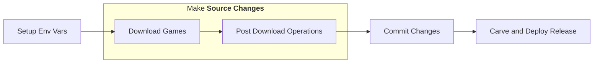

# Contributing

[//]: # (this is a comment)

[//]: # (Author this file as human, do not use code-gen)


## `How-to` Guides


### Publish new games on website

Use cases:

- Season has progressed, but recent games have not being "processed and published"



[//]: # (Fold steps after each mermaid graph in each Dev Guide to save space, later)

<details>
<summary>Step-by-step Guide</summary>

1. Prepare **Environment** Variables

    1. Select **"'Target Season'**

        For example for Season 2025 - 2026, set:

        ```
        SEASON=2025
        ```

    2. Set **'Operational Parameters'**

        ```
        RETRY_PASS=1
        CONCURRENCY=8
        WINDOW_SIZE="${CONCURRENCY}"
        LOG_LEVEL='INFO'
        ```

    3. Set **'Operational CONSTANTS'**
        
        ```
        DATA_DIR=/app/data
        ```

2. Make **Source changes**

    1. Download games up to today for **"'Target Season'**, using `main` images

        Build and Run `ops` image from `main` branch

        ```
        docker-compose -f docker-compose-legacy.yml run --rm --build ops sync_season_full --seasoncode "${SEASON}" --output-dir "${DATA_DIR}" --concurrency "${CONCURRENCY}" --window-size "${WINDOW_SIZE}" --log-level "${LOG_LEVEL}" --retry-pass
        ```

        This creates the `raw_` type of files.

    2. Post process and Normalize data

        ```sh
        docker-compose -f docker-compose-legacy.yml run ops normalize_season_data --seasoncode "${SEASON}" --data-dir ${DATA_DIR}

        # OR all seasons
        docker-compose -f docker-compose-legacy.yml run ops normalize_all_seasons --data-dir ${DATA_DIR}
        ```

    3. Update `Games Manifest`, that powers "cheap lookups" to frontend page(s)

        ```sh
        docker-compose -f docker-compose-legacy.yml run ops rebuild_manifest --all-seasons --output-dir "${DATA_DIR}"
        ```

    4. Update `ELOs`

        ```sh
        docker-compose -f docker-compose-legacy.yml run ops compute_elo --auto --output-dir "${DATA_DIR}" --output-name elo_multiseason.json
        ```

    5. Optional: print report on **"Target Season"**"

        ```sh
        docker-compose  -f docker-compose-legacy.yml run ops report_season --seasoncode "E${SEASON}" --data-dir "${DATA_DIR}"
        ```

    5. Optional: Check for Season winner and update

        Update the `SEASON_WINNERS` Object declared in `prod/elo.html`

3. Commit Changes

    1. Add Game `raw and derivative` Data Assets

        For example for Season 2025 - 2026

        - data/raw/raw_pts_E2025_*.json
        - data/multi_drilldown_real_data_E2025_*.json
        - data/score_timeline_E2025_*.json

        ```sh
        git add "data/raw/raw_pts_E${SEASON}_*.json"
        git add "data/multi_drilldown_real_data_E${SEASON}_*.json"
        git add "data/score_timeline_E${SEASON}_*.json"
        ```

        These should be "new files" to track from `git` pov.

        Each of the Games have 1 corresponding raw, multi-drilldown, and score timeline file.  
        For example, if we synnced 5 new Games, then we shall store 3 new files per Game: 5 x 3 = 15 new files.

    2. Add `Style Insights`, `Games Manifest`, and `ELO` updated file assets

        ```sh
        git add "data/style_insights_E${SEASON}.json"
        git add "data/games_manifest.json"
        git add "data/elo_multiseason.json"
        ```

        > **Info:** `Style Insights` power the data-driven `Team Style` UI Feature
        > **Info:** `Games Manifest` Is an `index` of the games data, allowing for efficient lookups.
        > **Info:** `ELO` data power the full ELO timeline and playback UI features

    3. Optionally, `git add` the `prod/elo.html`

        ```sh
        git add "prod/elo.html"
        ```

    3. Commit

4. Carve and Deploy a Release that includes the above commit

</details>
