# Adding Games: Data Flow and Consumers

This guide visualizes the add-games workflow described in [CONTRIBUTING.md](../CONTRIBUTING.md). It distinguishes the upstream EuroLeague API from this application's **Data Sources**: the files persisted locally and then read by pipeline jobs, build checks, or browser pages.

## Storage and Names

In the Docker workflow, the repository's `./data` is mounted as `/app/data`, and `BASKET_APP_FILE_STORE_URI=/app/data/raw` directs raw API snapshots into `data/raw/`. The sync command receives `--output-dir /app/data` for processed and derived season files. The browser later reads the committed files served as static assets; it does not call the EuroLeague API.

| File pattern | Written by / derived from | Current role |
|---|---|---|
| `data/raw/raw_pbp_{season}_{game}.json` | Snapshot of `/api/PlaybyPlay` | Retained raw snapshot. No current browser or later pipeline step reads this saved file; the builder uses the API response in memory. |
| `data/raw/raw_pts_{season}_{game}.json` | Snapshot of `/api/Points` | Read directly by score-diff/score-d52 pages and the game-explorer cone; also input to score timelines and other data operations. |
| `data/raw/raw_box_{season}_{game}.json` | Snapshot of `/api/Boxscore` | Read by the Lab shot-style maps; its in-memory response also enriches the processed game bundle. |
| `data/multi_drilldown_real_data_{season}_{game}.json` | Built from API responses by `build_from_euroleague_api.py` | Main Sankey/game payload and source for the game manifest and Elo calculations. |
| `data/score_timeline_{season}_{game}.json` | Derived from the saved `raw_pts` file | Input to style-insights generation; also required by the configured Pages build coverage check. Current production score-chart JavaScript reads `raw_pts` directly. |
| `data/style_insights_{season}.json` | Derived from that season's score timelines | Read by the production Style Insights page. |
| `data/elo_{season}.json`, `data/elo_multiseason.json` | Derived from processed game bundles | Per-season ratings can enrich manifest entries; multi-season ratings are read by the Elo page and game viewer. |
| `data/games_manifest.json` | Index built from processed game bundles (and available per-season Elo ratings) | Game discovery/switcher input for production viewers. |

Here `{season}` is a code such as `E2025`; `{game}` is the game's integer gamecode.

## 1. Sync Games

`sync_season_full` orchestrates season sync and style-insights generation. For each available game, the builder fetches the three API responses, persists raw snapshots, and builds the multi bundle from the responses in memory. The timeline is derived from `raw_pts`; style insights are derived from timelines.

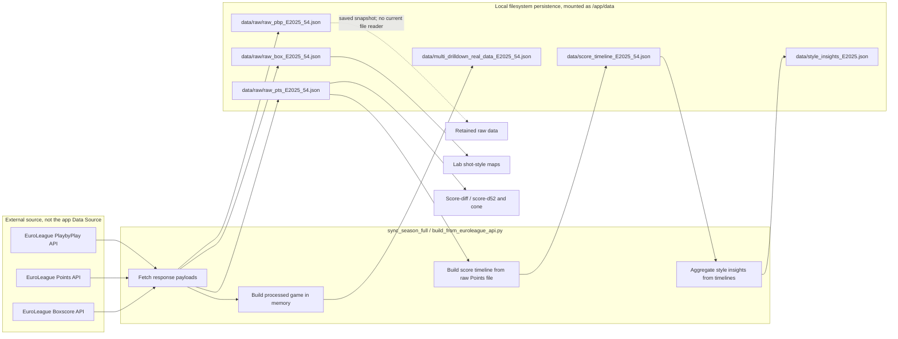

The persisted files are Data Sources when later code or a UI reads them. The EuroLeague endpoints are upstream source systems. In particular, `raw_pbp` is not an intermediate file that is reopened to create the multi bundle: the PlaybyPlay response is consumed before it is written as a snapshot.

## 2. Normalize Stored Game Data

Normalization canonicalizes content in the season's processed multi bundles in place. The normalizer does not normalize the raw API snapshots. Unless skipped, the CLI also refreshes `elo_multiseason.json`; the contributor guide's explicit Elo step remains useful for the intended full recomputation.

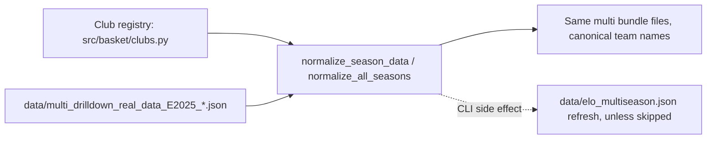

## 3. Rebuild the Games Manifest

The manifest indexes processed multi bundles so browser pages can discover games and load each bundle by filename. It is generated from the processed directory, not from the EuroLeague API or raw PBP snapshots.

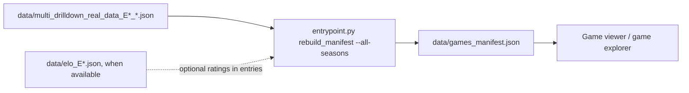

## 4. Compute Elo

The contributor command computes multi-season Elo from processed game bundles and writes the named output. The production Elo page and game viewer load this persisted file.

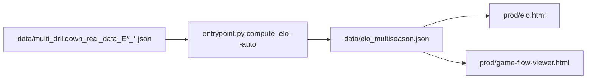

## 5. Optional Report and Manual Season Winner

The season report reads processed bundles and prints counts, teams, and date range to the console. It does not create a browser Data Source. Updating `SEASON_WINNERS` in `prod/elo.html` is a separate manual UI/source change, not a pipeline artifact.

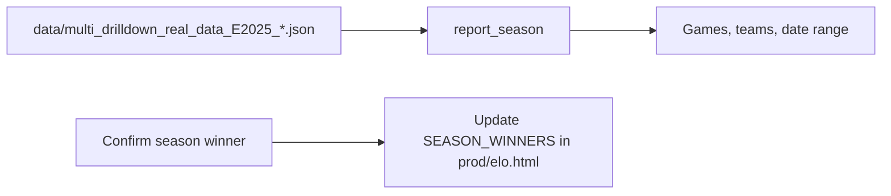

## 6. Commit and Publish

The repository is the persistence layer for published static JSON. Commit the generated artifacts needed by the app surfaces being published. The current build configuration requires the app's core bundles, raw Points, score timelines, manifest, and multi-season Elo; the Lab additionally requires raw Boxscore. `raw_pbp` is not a current app or build requirement. Style Insights also needs its generated season JSON when that page is published.

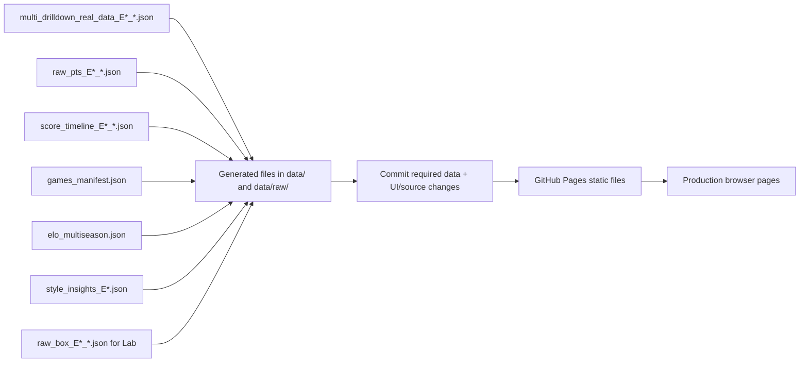

## Browser Data-Source Consumers

| Browser surface | Persisted Data Sources it reads | Role |
|---|---|---|
| `prod/game-flow-viewer.html` | `games_manifest.json`, selected `multi_drilldown_real_data_*.json`, `elo_multiseason.json`; optional auto-insights payload | Game selection, Sankey bundle, and Elo context. |
| `prod/game-explorer.html` / `prod/mvp-home.html` | `games_manifest.json`; `raw_pts_*.json` for the cone view | Game discovery and score/shot timeline visualization. |
| `prod/score-diff*.html`, `prod/score-d52*.html` via `prod/score-chart.js` | `raw_pts_*.json` | Score-difference charts; current code fetches the raw Points payload directly. |
| `prod/elo.html` | `elo_multiseason.json` | Elo history and rankings. |
| `prod/style-insights.html` | `style_insights_*.json` | Season consistency/adaptability insights. |
| Lab `shot-style-map.html`, `shot-style-map-3d.html` | `raw_pts_*.json`, `raw_box_*.json`, manifest | Shot-map calculations and team metadata. |

`score_timeline_*.json` is consumed by the style-insights generator and checked for coverage during the Pages build. Despite the build-config comment describing it as a cheap score-chart input, the current production chart implementation reads `raw_pts` directly; this document records the observed runtime path.

## Per-page Data-to-UI Diagrams

These diagrams trace persisted Data Sources to the page region that displays them. If a page embeds another HTML page in an iframe, the iframe is shown separately because that child page performs its own file loads.

### `prod/mvp-home.html`

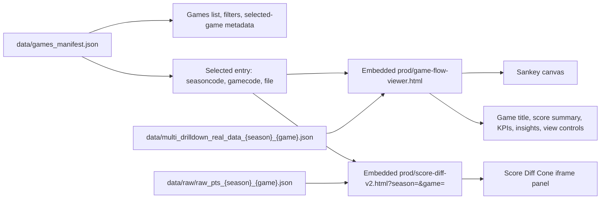

### `prod/game-explorer.html`

When anchor-team mode is enabled, `game-explorer.html` first fetches the selected multi bundle to reorder/style its team nodes, then passes the transformed bundle to the viewer. In ordinary mode it passes the selected manifest file URL directly.

### `prod/game-flow-viewer.html`

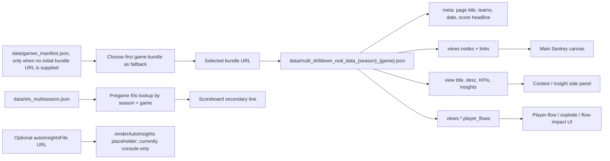

The viewer normally receives its selected bundle URL from a parent page or query parameter; the manifest is only its standalone fallback. The optional `autoInsightsFile` is fetched, but its current renderer is a placeholder rather than a visible UI panel.

### `prod/elo.html`

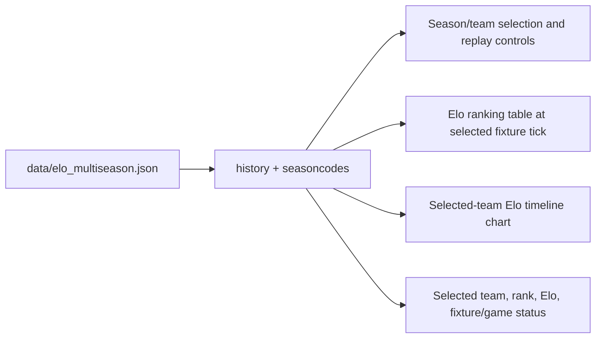

### `prod/index.html` (Elo compatibility page)

### `prod/score-diff.html`

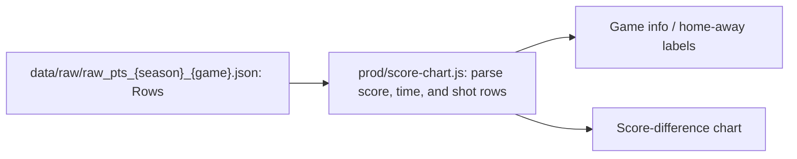

### `prod/score-d52.html`

### `prod/score-diff-v2.html`

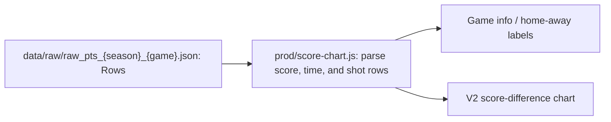

### `prod/score-d52-v2.html`

All four score pages use the shared `prod/score-chart.js` loader and read `raw_pts` directly. They do not fetch `score_timeline` in the current browser implementation.

### `prod/style-insights.html`

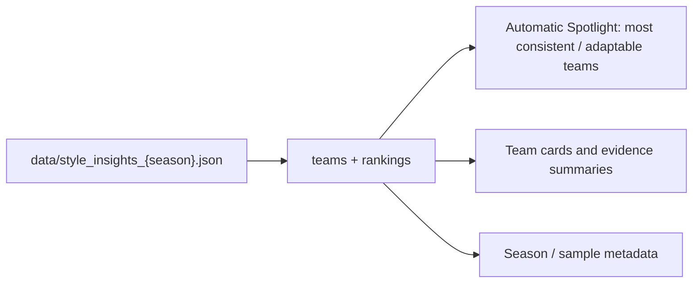

### `lab/game-flow-switcher.html`

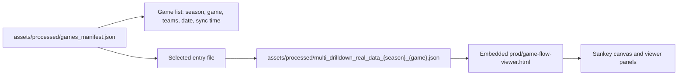

### `lab/shot-style-map.html`

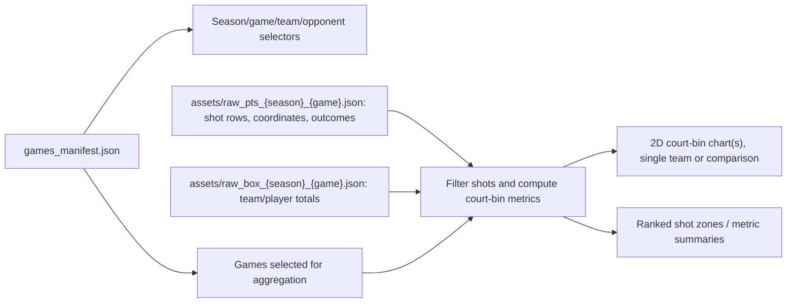

### `lab/shot-style-map-3d.html`

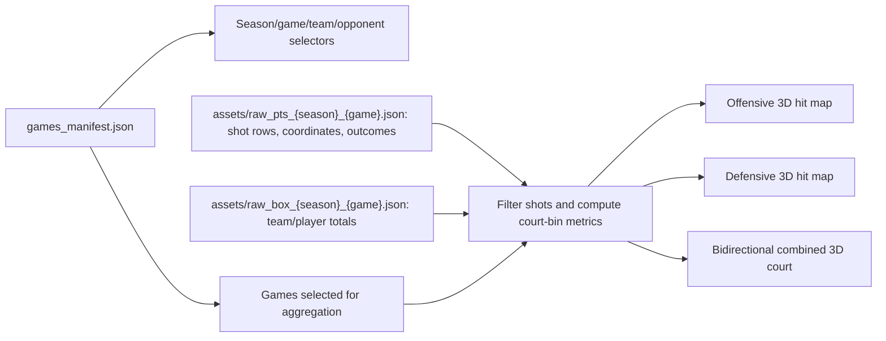

### `lab/style-consistency-lab.html`

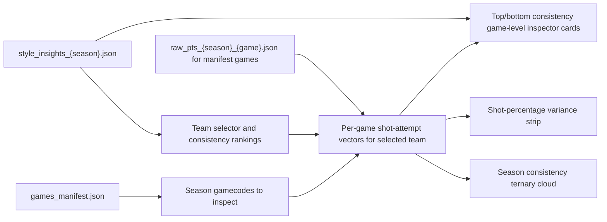

The persisted payloads power the shown output regions; query controls and page-local settings are not Data Sources. `prod/team-anchor-compare.html` currently has no persisted JSON fetch and therefore is not included as a file-backed data flow.

## Code References

- Sync orchestration and artifacts: `entrypoint.py`, `season_sync.py`, `build_from_euroleague_api.py`, `build_score_timeline.py`, `style_insights.py`
- Build requirements: `config/build_config.jsonc`, `scripts/build_bundle.sh`
- Browser loaders: `prod/game-flow-viewer.html`, `prod/game-explorer.html`, `prod/score-chart.js`, `prod/style-insights.html`, `prod/runtime-config.js`