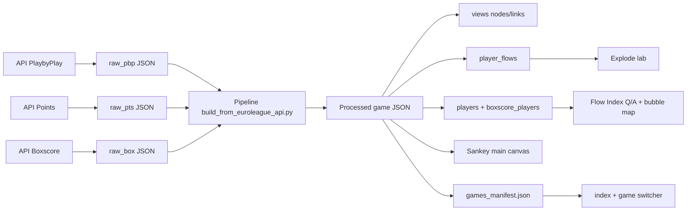

# Data Inspection Reference

This document is the canonical reference for what data we read, how we classify it, and how it flows into the UI.

## Source Surface

| Layer | Source | Endpoint / File | Notes |
|---|---|---|---|
| Raw API | Euroleague live API | `/api/PlaybyPlay` | Primary event stream for possession inference and player attribution. |
| Raw API | Euroleague live API | `/api/Points` | Shot-level enrichments (coordinates, zone, shot action, player). |
| Raw API | Euroleague live API | `/api/Boxscore` | Team/player boxscore stats (`Valuation`, `Plusminus`, etc.). |
| Raw cache | Local files | `assets/raw_pbp_*.json` | Saved PlayByPlay payload snapshots. |
| Raw cache | Local files | `assets/raw_pts_*.json` | Saved Points payload snapshots. |
| Raw cache | Local files | `assets/raw_box_*.json` | Saved Boxscore payload snapshots. |
| Processed | Local files | `assets/processed/multi_drilldown_real_data_*.json` | Main UI input files. |
| Processed index | Local files | `assets/processed/games_manifest.json` | Game switcher manifest. |

## Semantics (Data Types)

| Semantic Type | Meaning | Examples |
|---|---|---|
| `raw` | Data fields as delivered by API with minimal/no transformation. | `PLAYTYPE`, `PLAYER_ID`, `COORD_X`, `Valuation` |
| `processed` | Organized output payload to serve UI modules. | `views`, `colors`, `players`, `boxscore_players` |
| `computed` | Deterministic calculations from raw/processed fields. | `kpis`, starts counts, `Flow Index = volume * expected_points` |
| `modeled/inferred` | Heuristic or inferred categories and attributions. | possession origin labels, subtype labels, `player_flows` |

## Current Gold Fields by Section

| Section | Key Fields |
|---|---|
| `meta` | `seasoncode`, `gamecode`, `team_a`, `team_b`, `gamedate`, `synced_at`, `source_endpoints` |
| `players` | `player_id -> {name, team}` |
| `boxscore_players` | `player_id`, `player_name`, `team`, `minutes`, `points`, `valuation`, `plusminus`, `assists`, `rebounds`, `turnovers` |
| `views.<view>.nodes` | `id`, `name`, `team`, `stage` |
| `views.<view>.links` | `source`, `target`, `value` |
| `views.<view>.player_flows` | `"source->target" -> [{player_id, player_name, team, poss}]` |

## Mermaid: High-Level Data Flow

## API Availability Notes

- Confirmed ingest endpoints used in this project:
  - `PlaybyPlay`
  - `Points`
  - `Boxscore`
- Other candidate endpoint names tested during inspection (for example `ShotChart`, `Summary`, `AdvancedStats`) returned HTML "Not found" pages from the same `/api/<name>` path and are currently not part of ingestion.

